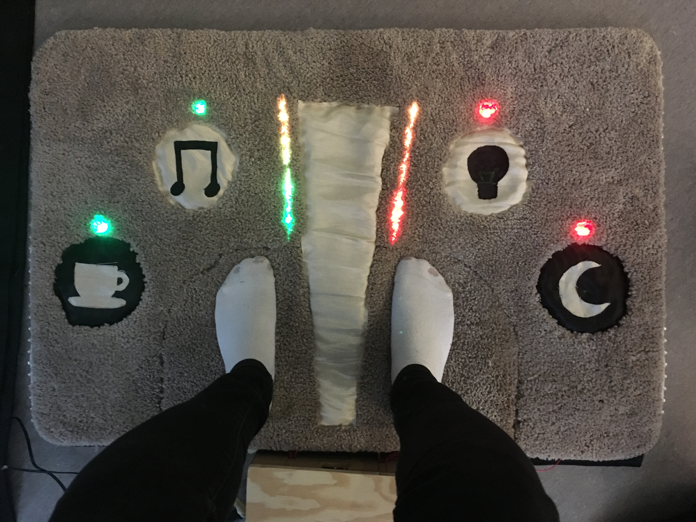

# TangibleMat
The final group project in the course Tangible Interaction at the Interaction Design master program at Chalmers University of Technology.

**Concept**
The mat is a tangible interface controlled with your feet that you can control your smart home with. For example your IoT lamp.

